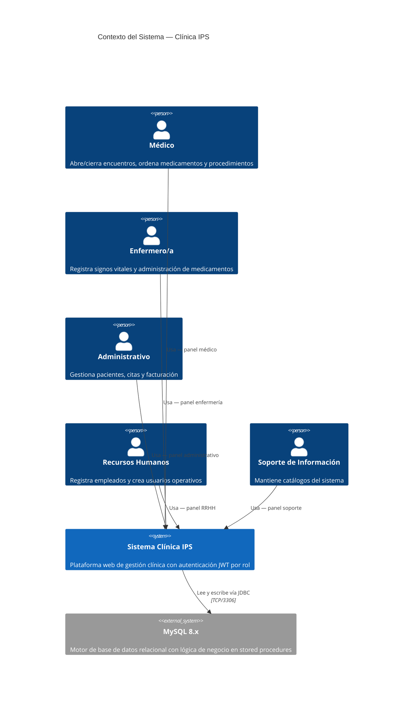
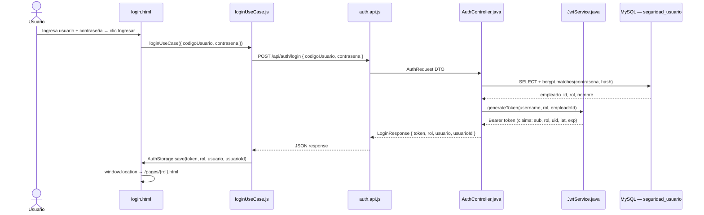
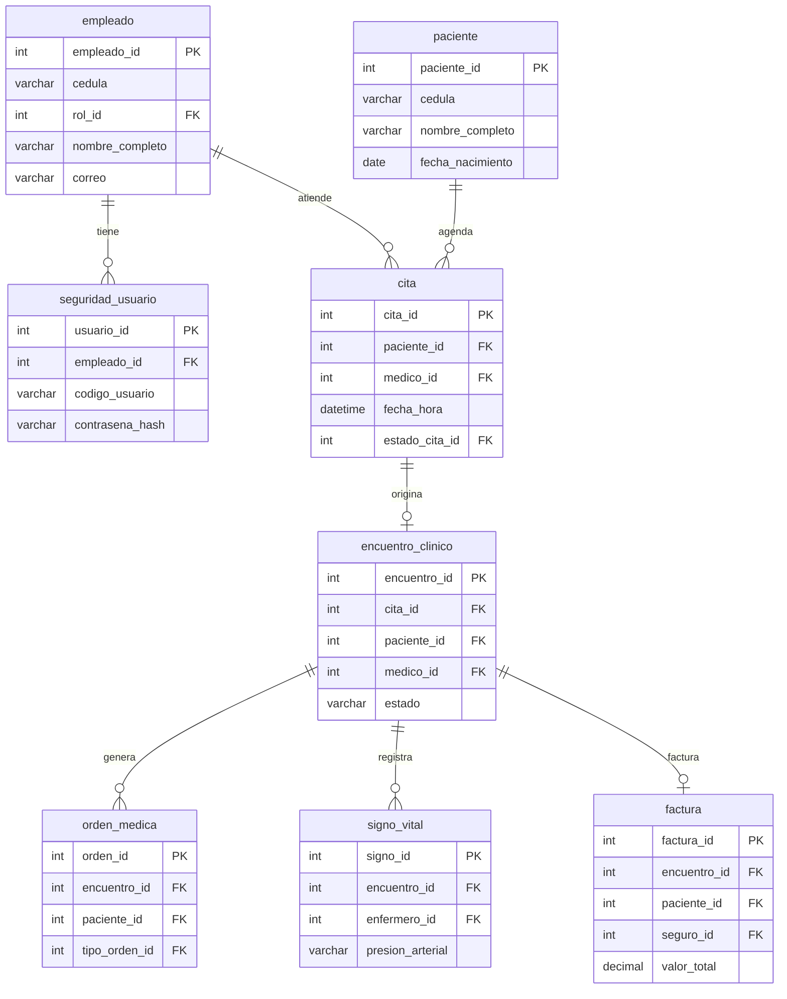

# Arquitectura C4 — Clínica IPS

> Modelo C4 (Context → Container → Component → Code) del sistema de gestión clínica.
> Diagramas en sintaxis [Mermaid](https://mermaid.js.org/).

---

## Nivel 1 — Diagrama de Contexto del Sistema

Muestra **quién** usa el sistema y **qué sistemas externos** intervienen.



---

## Nivel 2 — Diagrama de Contenedores

Desglosa el sistema en sus **tres contenedores ejecutables**.

```mermaid
C4Container
    title Contenedores — Clínica IPS

    Person(usuario, "Usuario del sistema", "Cualquiera de los 5 roles")

    Container_Boundary(sys, "Sistema Clínica IPS") {

        Container(frontend, "Frontend Estático",
            "HTML5 · Vanilla JS ES2022 · Bootstrap 5.3",
            "SPA por rol servida por Node.js/Express en el puerto 3000.\nMódulos: login, administrativo, doctor, enfermera, rrhh, soporte")

        Container(backend, "API REST",
            "Java 17 · Spring Boot 4.x · Spring Security",
            "Expone endpoints REST con autenticación JWT Bearer.\nValidación Bean Validation. Puerto 8083.")

        ContainerDb(db, "Base de Datos",
            "MySQL 8.x",
            "Schema clinica_ips. Toda la lógica de negocio reside\nen stored procedures. Puerto 3306.")
    }

    Rel(usuario,  frontend, "Accede desde el navegador", "HTTP :3000")
    Rel(frontend, backend,  "Llama la API REST", "HTTP/JSON :8083")
    Rel(backend,  db,       "Ejecuta stored procedures", "JDBC TCP :3306")
```

---

## Nivel 3 — Diagrama de Componentes: API REST (Backend)

Componentes internos del contenedor Spring Boot.

```mermaid
C4Component
    title Componentes — API REST (Spring Boot :8083)

    Container_Boundary(api, "API REST") {

        Component(authCtrl,  "AuthController",           "POST /api/auth/login",
                  "Autentica credenciales, genera JWT y devuelve LoginResponse\n{token, rol, usuario, usuarioId}")

        Component(adminCtrl, "AdministrativoController", "@RestController /api/administrativo",
                  "Gestión de pacientes, contactos, seguros, citas,\nreprogramación, cancelación, facturación y pagos")

        Component(docCtrl,   "DoctorController",         "@RestController /api/doctor",
                  "Apertura/cierre de encuentros clínicos,\nórdenes médicas y detalles de orden")

        Component(enfCtrl,   "EnfermeraController",      "@RestController /api/enfermera",
                  "Registro de signos vitales y\nadministración de medicamentos")

        Component(rrhHCtrl,  "RecursosHumanosController","@RestController /api/rrhh",
                  "Alta de empleados y creación de\nusuarios operativos del sistema")

        Component(sptCtrl,   "SoporteController",        "@RestController /api/soporte",
                  "CRUD completo de catálogos: roles, documentos,\nespecialidades, medicamentos, procedimientos, etc.")

        Component(jwtFilter, "JwtAuthFilter",            "OncePerRequestFilter",
                  "Intercepta cada petición, valida el Bearer token\ny puebla el SecurityContext")

        Component(jwtSvc,    "JwtService",               "Servicio de utilidad JWT (JJWT 0.12)",
                  "Genera tokens con claims {sub, rol, uid}.\nVerifica firma y expiración (TTL 24 h)")

        Component(domSvc,    "Servicios de Dominio",     "Spring @Service",
                  "Capa de aplicación que delega cada operación\nal stored procedure correspondiente vía EntityManager")
    }

    ContainerDb(db, "MySQL 8.x", "clinica_ips", "Stored procedures y tablas")

    Rel(authCtrl,  jwtSvc,  "genera token")
    Rel(jwtFilter, jwtSvc,  "valida token")
    Rel(adminCtrl, domSvc,  "invoca")
    Rel(docCtrl,   domSvc,  "invoca")
    Rel(enfCtrl,   domSvc,  "invoca")
    Rel(rrhHCtrl,  domSvc,  "invoca")
    Rel(sptCtrl,   domSvc,  "invoca")
    Rel(domSvc,    db,      "CALL sp_*()", "JDBC")
```

---

## Nivel 3 — Diagrama de Componentes: Frontend (Browser)

Arquitectura interna del cliente JavaScript, organizada por módulo/rol.

```mermaid
C4Component
    title Componentes — Frontend (Vanilla JS ES2022 :3000)

    Container_Boundary(fe, "Frontend — clinic-frontend/public/") {

        Component(login,    "Módulo Login",          "login/",
                  "Entidad AuthEntity, caso de uso loginUseCase,\nAPI auth.api.js → POST /api/auth/login.\nGuarda JWT + rol en localStorage vía AuthStorage.")

        Component(admin,    "Módulo Administrativo", "administrativo/",
                  "Presentación: cita.controller, facturacion.controller,\npaciente.controller.\nCasos de uso para paciente, cita, factura, pago,\ncontacto emergencia, seguro médico.")

        Component(doctor,   "Módulo Doctor",         "doctor/",
                  "Presentación: encuentro.controller, orden.controller.\nCasos de uso para abrir/cerrar encuentros,\nórdenes médicas y detalles de orden.")

        Component(enfermera,"Módulo Enfermería",     "enfermera/",
                  "Presentación: enfermera.controller.\nCasos de uso para signos vitales\ny administración de medicamentos.")

        Component(rrhh,     "Módulo RRHH",           "rrhh/",
                  "Presentación: rrhh.controller.\nCasos de uso para registro de empleados\ny creación de usuarios operativos (bcryptjs).")

        Component(soporte,  "Módulo Soporte",        "soporte/",
                  "Presentación: soporte.controller.\nCRUD de catálogos del sistema.")

        Component(shared,   "Compartidos",           "shared/",
                  "AuthStorage (localStorage JWT),\nresult.banner.js (feedback UI),\napi.client.js (fetch con Authorization header).")
    }

    Container(srv,  "Express :3000", "Node.js", "Servidor estático")
    Container(api,  "Spring Boot :8083", "Java", "API REST")

    Rel(login,    shared, "usa AuthStorage")
    Rel(admin,    shared, "usa AuthStorage + banner")
    Rel(doctor,   shared, "usa AuthStorage + banner")
    Rel(enfermera,shared, "usa AuthStorage + banner")
    Rel(rrhh,     shared, "usa AuthStorage + banner")
    Rel(soporte,  shared, "usa AuthStorage + banner")
    Rel(admin,    api,    "HTTP/JSON")
    Rel(doctor,   api,    "HTTP/JSON")
    Rel(enfermera,api,    "HTTP/JSON")
    Rel(rrhh,     api,    "HTTP/JSON")
    Rel(soporte,  api,    "HTTP/JSON")
    Rel(login,    api,    "POST /api/auth/login")
```

---

## Nivel 4 — Flujo de Código: Autenticación JWT

Secuencia detallada desde el formulario de login hasta que el cliente queda autenticado.



---

## Mapa de Endpoints REST

| Controlador | Método | Ruta | Acción |
|---|---|---|---|
| `AuthController` | POST | `/api/auth/login` | Autenticación |
| `AdministrativoController` | POST | `/api/administrativo/pacientes` | Registrar paciente |
| | POST | `/api/administrativo/contactos-emergencia` | Contacto de emergencia |
| | POST | `/api/administrativo/seguros` | Seguro médico |
| | POST | `/api/administrativo/citas` | Programar cita |
| | PUT | `/api/administrativo/citas/reprogramar` | Reprogramar cita |
| | PUT | `/api/administrativo/citas/cancelar` | Cancelar cita |
| | GET | `/api/administrativo/facturacion/copago` | Calcular copago |
| | POST | `/api/administrativo/facturacion/facturas` | Emitir factura |
| | POST | `/api/administrativo/facturacion/pagos` | Registrar pago |
| `DoctorController` | POST | `/api/doctor/encuentros` | Abrir encuentro |
| | PUT | `/api/doctor/encuentros/cerrar` | Cerrar encuentro |
| | POST | `/api/doctor/ordenes` | Registrar orden médica |
| | POST | `/api/doctor/ordenes/detalle` | Agregar detalle de orden |
| `EnfermeraController` | POST | `/api/enfermera/signos-vitales` | Registrar signos vitales |
| | POST | `/api/enfermera/administracion-medicamentos` | Administrar medicamento |
| `RecursosHumanosController` | POST | `/api/rrhh/empleados` | Registrar empleado |
| | POST | `/api/rrhh/usuarios` | Crear usuario operativo |
| `SoporteController` | CRUD | `/api/soporte/**` | Gestión de catálogos |

---

## Modelo de Datos — Entidades Principales


